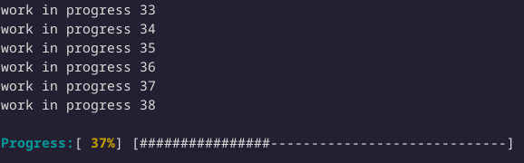

Multiline progress bar for golang CLI.



### Usage

```bash
go get github.com/ermineaweb/pbar-multiline
```

```golang
// Sync
pb := pbar.NewProgressBar(50)
pb.Add(1)

// Async
pb := pbar.NewAsyncProgressBar(50)
defer pb.Add(1)
```

### Examples

Sync version

```golang
import 	"github.com/ermineaweb/pbar-multiline"

func main() {
	pb := pbar.NewProgressBar(50)

	for i := 1; i <= pb.Total; i++ {
		work(i)
		pb.Add(1)
	}
}

func work(i int) {
	// simulate a long random work
	rnd := rand.Intn(6000) + 1000
	time.Sleep(time.Duration(rnd) * time.Millisecond)
}
```

Async version

```golang
import 	"github.com/ermineaweb/pbar-multiline"

func main() {
	var wg sync.WaitGroup
	pb := pbar.NewAsyncProgressBar(50)

    for i := 1; i <= pb.Total; i++ {
    	wg.Add(1)
    	go func(index int) {
    		defer wg.Done()
    		defer pb.Add(1)
    		work(index)
    	}(i)
    }

    wg.Wait()
}

func work(i int) {
	// simulate a long random work
	rnd := rand.Intn(6000) + 1000
	time.Sleep(time.Duration(rnd) * time.Millisecond)
}
```
